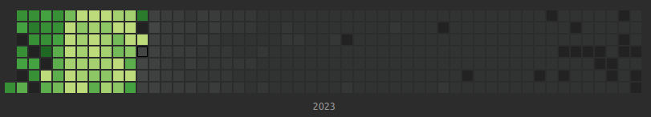

My 52 days streak is now lost. And it exactly happened on the day I did my German exam. At this day I put more than 5 hours for German learning related tasks, which is a new record. But then forgot to study my flashcards and lost my streak.

What a shame. Now I am 51 days further than two days before, from achieving a full-year streak.
